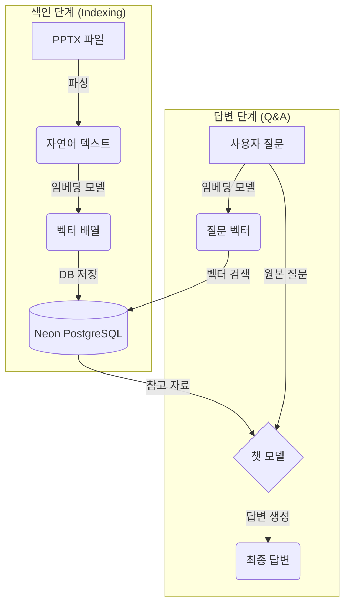

# 🚀 Policy Embedder: AI 기반 정책 문서 Q&A 시스템

**Policy Embedder**는 RAG(Retrieval-Augmented Generation) 기술을 활용하여, 사용자가 업로드한 정책 문서(PPTX)에 대해 자연어 질의응답을 수행하는 AI 백엔드 시스템입니다.

<br>

## ✨ 주요 기능

- **PPTX 문서 처리**: PowerPoint(`_pptx_`) 파일을 파싱하여 텍스트 정보를 추출합니다.
- **의미 기반 임베딩**: 추출된 텍스트를 OpenAI 임베딩 모델을 통해 의미를 담은 벡터(Vector)로 변환합니다.
- **벡터 저장 및 검색**: 변환된 벡터를 **Neon PostgreSQL** 데이터베이스(**pgvector** 확장)에 저장하고, 사용자 질문과 의미적으로 가장 유사한 내용을 검색합니다.
- **AI 답변 생성**: 검색된 문서 내용을 근거로 OpenAI 챗 모델(GPT)이 신뢰도 높은 답변을 생성합니다.

<br>

## ⚙️ 동작 흐름

아래 다이어그램은 Policy Embedder의 전체 데이터 흐름을 보여줍니다.



<br>

## 💻 기술 스택

| 구분 | 기술 |
| :--- | :--- |
| **언어** | Kotlin |
| **프레임워크** | Spring Boot 3, Spring AI |
| **데이터베이스** | **PostgreSQL (on Neon) with pgvector** |
| **AI 모델** | OpenAI (text-embedding-3-small, gpt-4.1-mini) |
| **빌드 도구** | Gradle |
| **컨테이너** | Docker |

<br>

## 🔌 API 엔드포인트

### 1. 정책 문서 업로드

- `POST /ingest/pptx`
- PPTX 문서를 업로드하여 데이터베이스에 임베딩 및 저장합니다.

| 구분 | 설명 | 예시 |
| :--- | :--- | :--- |
| **URL** | `/ingest/pptx` | |
| **Method** | `POST` | |
| **Content-Type** | `multipart/form-data` | |
| **Request** | `file` (form-data key)<br>`title` (required)<br>`version` (optional) | `policy.pptx`<br>`"회사 정책서"`<br>`"v1.0"` |

**cURL 예시:**
```bash
curl -X POST http://localhost:8080/ingest/pptx \
  -F "file=@/경로/내/policy.pptx" \
  -F "title=회사 정책서" \
  -F "version=v1.0"
```

### 2. 질의응답

- `POST /ask`
- 저장된 문서 기반으로 질문에 대한 답변을 요청합니다.

| 구분 | 설명 | 예시 |
| :--- | :--- | :--- |
| **URL** | `/ask` | |
| **Method** | `POST` | |
| **Content-Type** | `application/json` | |
| **Request Body** | `q` (string, required)<br>`k` (int, optional, default: 6)<br>`version` (string, optional) | `{"q": "연차 사용 규정이 어떻게 되나요?", "k": 5}` |

**cURL 예시:**
```bash
curl -X POST http://localhost:8080/ask \
  -H "Content-Type: application/json" \
  -d '{"q": "연차 사용 규정이 어떻게 되나요?", "k": 5}'
```

### 3. 문서 검색 (선택적)

- `GET /search`
- 저장된 문서에서 유사도 검색을 수행합니다.

| 구분 | 설명 | 예시 |
| :--- | :--- | :--- |
| **URL** | `/search` | |
| **Method** | `GET` | |
| **Query Param** | `q` (string, required)<br>`k` (int, optional, default: 5) | `연차` |

**cURL 예시:**
```bash
curl -X GET "http://localhost:8080/search?q=연차&k=3"
```

<br>

## 🚀 시작하기

### 1단계: 사전 요구사항

- **Java 21** (or higher)
- **Neon 계정** 및 PostgreSQL 데이터베이스
- **OpenAI API 키**

### 2단계: 데이터베이스 설정

1.  **Neon 프로젝트 생성**: [Neon](https://neon.tech/)에 로그인하여 새로운 프로젝트와 데이터베이스를 생성합니다.
2.  **pgvector 확장 활성화**: 생성된 데이터베이스의 `Query Editor`에서 다음 쿼리를 실행하여 pgvector를 활성화합니다.
    ```sql
    CREATE EXTENSION IF NOT EXISTS vector;
    ```
3.  **Connection String 확인**: Neon 대시보드에서 `Connection Details` 위젯을 통해 JDBC 연결 정보를 확인합니다.

### 3단계: 환경 변수 설정

애플리케이션은 `application.yml`에 정의된 대로 환경 변수를 통해 주요 설정값을 주입받습니다. 아래 변수들을 실행 환경에 맞게 설정해주세요.

- `OPENAI_API_KEY`: OpenAI에서 발급받은 API 키
- `DATA_SOURCE_URL`: 데이터베이스 연결 URL (PostgreSQL JDBC 형식)
- `DATA_SOURCE_USERNAME`: 데이터베이스 사용자명
- `DATA_SOURCE_PASSWORD`: 데이터베이스 접속 비밀번호
- `DATA_SOURCE_SCHEMA`: 벡터 저장소 스키마명 (pgvector 테이블이 생성될 스키마)

**환경 변수 설정 예시:**
```bash
export OPENAI_API_KEY="sk-..."
export DATA_SOURCE_URL="jdbc:postgresql://your-host:5432/your-database"
export DATA_SOURCE_USERNAME="your-username"
export DATA_SOURCE_PASSWORD="your-password"
export DATA_SOURCE_SCHEMA="public"
```

### 4단계: 애플리케이션 실행

#### A. 로컬에서 직접 실행

```bash
# 필요한 환경 변수를 먼저 export 합니다.
export OPENAI_API_KEY="sk-..."
export DATA_SOURCE_URL="jdbc:postgresql://your-host:5432/your-database"
export DATA_SOURCE_USERNAME="your-username"
export DATA_SOURCE_PASSWORD="your-password"
export DATA_SOURCE_SCHEMA="public"

# Gradle Wrapper를 사용하여 애플리케이션을 실행합니다.
./gradlew bootRun
```

#### B. Docker로 실행

```bash
# 1. Gradle로 애플리케이션을 빌드합니다.
./gradlew build

# 2. Docker 이미지를 빌드합니다.
docker build -t policy-embedder .

# 3. 환경 변수와 함께 Docker 컨테이너를 실행합니다.
docker run -p 8080:8080 \
  -e OPENAI_API_KEY="sk-..." \
  -e DATA_SOURCE_URL="jdbc:postgresql://your-host:5432/your-database" \
  -e DATA_SOURCE_USERNAME="your-username" \
  -e DATA_SOURCE_PASSWORD="your-password" \
  -e DATA_SOURCE_SCHEMA="public" \
  policy-embedder
```

<br>

## 📁 프로젝트 구조

```
src/main/kotlin/org/mvp/policy/embedder/
├── PolicyEmbedderApplication.kt        # 메인 애플리케이션 클래스
├── config/
│   └── WebMvcConfig.kt                 # Web MVC 설정
├── ingest/                             # 문서 수집 및 임베딩 처리
│   ├── IngestController.kt             # PPTX 업로드 API
│   ├── IngestService.kt                # 문서 처리 및 벡터스토어 저장 로직
│   ├── PptxLoader.kt                   # PPTX 파싱 (슬라이드, 표, 노트 포함)
│   └── SearchController.kt             # 벡터 검색 API
└── qa/                                 # 질의응답 처리
    ├── AskController.kt                # Q&A API 엔드포인트
    └── QaService.kt                    # RAG 기반 답변 생성 로직
```

<br>

## ⚡ 주요 기능 상세

### 📄 PPTX 문서 처리 (PptxLoader)
- **슬라이드 본문**: 텍스트 도형에서 텍스트 추출
- **표 데이터**: 표를 마크다운 형식으로 변환하여 구조화
- **슬라이드 노트**: 발표자 노트 정보 추출
- **메타데이터**: 제목, 버전, 섹션 정보 포함

### 🧠 임베딩 및 벡터 저장 (IngestService)
- **토큰 기반 청킹**: 800토큰 단위로 문서 분할
- **자동 임베딩**: OpenAI text-embedding-3-small 모델 사용
- **pgvector 저장**: PostgreSQL의 pgvector 확장을 통한 벡터 저장
- **메타데이터 보존**: 문서 출처 정보 유지

### 💬 지능형 Q&A (QaService)
- **의미 기반 검색**: 사용자 질문과 유사한 문서 청크 검색
- **버전 필터링**: 특정 정책 버전으로 검색 결과 제한 가능
- **컨텍스트 구성**: 최대 8개 문서, 8000자 제한으로 최적화
- **신뢰성 있는 답변**: GPT-4.1-mini를 통한 정확한 답변 생성

<br>

## 🔧 설정 세부사항

### OpenAI 모델 설정
- **임베딩 모델**: text-embedding-3-small (1536차원)
- **채팅 모델**: gpt-4.1-mini (temperature: 0.2)

### pgvector 설정
- **테이블명**: vector_store
- **인덱스 타입**: HNSW (Hierarchical Navigable Small World)
- **거리 측정**: COSINE_DISTANCE
- **파일 업로드**: 최대 200MB